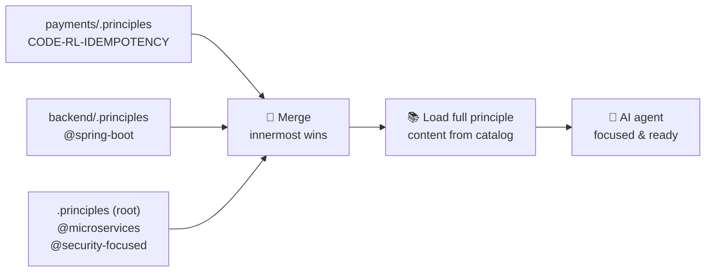
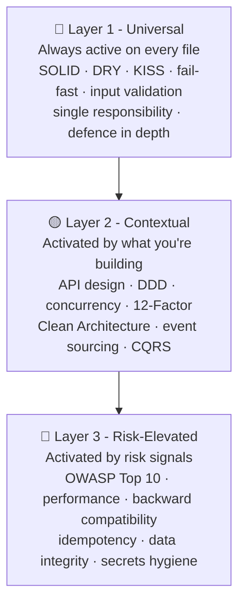
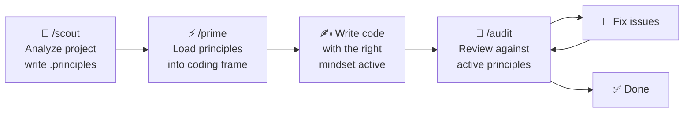

# .principles

**Select the software engineering principles you want your AI coding agent to focus on.**

A curated catalog of software engineering principles, organized into a `.principles` hierarchy that projects declare to guide AI code generation and review.

> See [DISCLAIMER.md](DISCLAIMER.md) — this is a proof of concept. Groups are opinionated, gaps exist, and adjustments are expected.

---

## 💡 Why `.principles`?

> *"The AI already knows everything. The question is: does it know what **you** care about?"*

In 2026, AI coding agents are genuinely impressive. Ask one to review your code and it will draw on a vast body of established software engineering knowledge:

- 🏗️ **Design** — SOLID, Gang of Four (Strategy, Observer, Factory, Decorator…), GRASP, DRY, KISS, YAGNI, Clean Code, Kent Beck's 4 Rules of Simple Design
- 🏛️ **Architecture** — Clean Architecture, Hexagonal / Ports & Adapters, DDD (Aggregates, Bounded Contexts, Repositories, Anti-Corruption Layers), CQRS, Event Sourcing, Microservices patterns, 12-Factor App
- 🔐 **Security** — OWASP Top 10, defense-in-depth, least privilege, zero-trust, secrets hygiene, secure-by-default
- ⚡ **Reliability & Performance** — circuit breakers, bulkhead, idempotency, backpressure, caching strategies, connection pooling, database indexing
- 🧪 **Testing** — test pyramid, TDD, BDD, contract testing, property-based testing, mutation testing
- ☁️ **Infrastructure** — Infrastructure as Code, immutable infrastructure, GitOps, Kubernetes patterns, observability (logs, metrics, traces)

**Knowing all of this is not the same as knowing which of it to apply.**

When an AI agent opens your file and starts writing or reviewing code — it doesn't automatically know:

- Should it scrutinize **security** here? *(Is this a payment handler or a helper utility?)*
- Should **DDD aggregates** guide this design? *(Is this a rich domain model or a thin CRUD layer?)*
- Is **backward compatibility** a hard constraint? *(Is this a public API or an internal module?)*
- Should **concurrency principles** be front-of-mind? *(Is this code on a hot, multi-threaded path?)*

Without that context, the AI picks reasonable defaults. But *reasonable defaults are not your architecture*.

**`.principles` is the bridge between what the AI knows and what it should focus on.** It doesn't teach the AI — it gives it your *intent*.

---

### 🌳 A codebase is a tree of different worlds

A real project is rarely uniform. A monorepo typically contains multiple sub-trees with entirely different stacks, concerns, and risk profiles. The `.principles` hierarchy maps directly onto that structure — just like `.gitignore`, rules cascade from the root and subdirectories can **add, narrow, or suppress**:

```
my-project/
├── .principles                    ◄ 🌐 @microservices + @security-focused
│
├── backend/
│   ├── .principles                ◄ ☕ @spring-boot  (Java · REST · DDD)
│   └── src/
│       └── payments/
│           └── .principles        ◄ 💳 CODE-RL-IDEMPOTENCY  (payment-specific scrutiny)
│
├── frontend/
│   ├── .principles                ◄ ⚛️  @react + @typescript
│   └── src/
│
├── infra/
│   └── .principles                ◄ 🏗️  @terraform + @twelve-factor
│
└── docs/
    └── .principles                ◄ 📝 (minimal — no security scanning in prose)
```

The `backend/` team gets Spring Boot + DDD focus. The `frontend/` team gets React + TypeScript patterns. The `payments/` service gets extra idempotency scrutiny on top of everything above it. The resolution walks **up** from the file being reviewed to the git root, merging files as it goes — innermost wins:



---

### 🤖 Let the AI scout your project

You don't need to figure out which principles apply yourself. The `/scout` command analyzes your file structure and writes the `.principles` files for you:

```
/scout

→ Analyzing file structure and detecting stack...
→ Detected: Spring Boot backend · React frontend · Terraform infra · Payment domain
→ Writing .principles            → @microservices + @security-focused
→ Writing backend/.principles   → @spring-boot
→ Writing frontend/.principles  → @react + @typescript
→ Writing infra/.principles     → @terraform + @twelve-factor
→ Writing backend/src/payments/.principles → CODE-RL-IDEMPOTENCY

Done ✅  Run /prime before your next coding session.
```

Of course you can also write these files manually — the format is just plain text.

---

### 🧱 Three layers, always intentional

Principles are organized into three activation layers that reflect how universally they apply:



Layer 1 always fires. Layer 2 activates for code that warrants domain or architectural guidance. Layer 3 kicks in when risk signals are present — public APIs, financial transactions, high-traffic paths, sensitive data. `.principles` files let you compose exactly the right combination for each part of your system.

---

### 🔄 Shift left — catch it while you're writing, not after

Traditional code review is valuable. But it happens *after* the code is already written — and the later a problem is caught, the more expensive it is to fix. Rearchitecting after the fact is painful. Rewriting after merge is costly. Finding a security flaw in production is a crisis.

`.principles` supports a **shift-left quality loop** where principles are active *before and during* coding, not just when auditing:



`/prime` is the key step. It resolves the full `.principles` hierarchy and loads the complete principle guidance into the AI's context *before* a single line is written. The AI doesn't just know the principles in the abstract — it has them front-of-mind as it generates code, the same way an experienced senior developer does when they sit down to work.

`/audit` then gives you the gut-check: not just "does this compile?" or "are there obvious bugs?" — but *"does this code reflect good engineering?"* Critical findings need immediate attention. But you also want the broader signal: is this code well-structured, secure, maintainable, and consistent with the architecture? That's quality assurance, not just bug hunting.

---

### 🧬 Transferring the developer mindset

Here is the deeper insight behind this project.

A great senior developer doesn't consult a checklist before every line they write. They have internalized principles over years of experience — SOLID, clean boundaries, security hygiene, failure modes. That internalized knowledge shapes *how they think* while coding. It's a **mindset**, not a procedure.

AI agents are already technically capable of producing correct, working code. That's not the bottleneck. The bottleneck is that they tend to generate code that *works* without necessarily generating code that is *well-principled* — unless the principles are made explicit.

`.principles` is how you make them explicit. You are not configuring a linter. You are not writing more rules. You are **transferring the mindset** of a principled software engineer to the AI agent working on your codebase.

> 🎯 The AI writes the code. You bring the craft.

---

## 🧠 Philosophy

`.principles` does **not** teach the AI anything. Modern AI coding agents already know SOLID, OWASP, DDD, and the rest. The point is to **focus and trigger** that knowledge — to give the AI context about *which* principles matter for *this* codebase, alongside the other AI instructions it receives (AGENTS.md, CLAUDE.md, `.github/copilot-instructions.md`, etc.).

Think of it as: the AI instructions tell the agent *how to behave*; `.principles` tells it *which engineering lens to apply*.

While `.principles` is currently focused on coding principles, it is not limited to code. Anything that follows the "X as Code" approach — documentation, infrastructure definitions, configuration — is plain text in version control, and therefore available for principle-driven review and auditing.

## ⚙️ How it works

Place a `.principles` file in your project root (and optionally in subdirectories) to declare which principles apply:

```
# Activate all Spring Boot principles (includes java)
@spring-boot

# Add a specific principle
CODE-OB-004

# Suppress a principle for this subtree
!CODE-API-012
```

The system walks up from the reviewed file to the git root, collecting `.principles` files and merging them (outermost first, innermost last). The AI then reads the full principle content before coding or reviewing.

### 🗂️ Layer model

| Layer                       | When                          | What                                                                               |
|-----------------------------|-------------------------------|------------------------------------------------------------------------------------|
| **Layer 1 — Universal**     | Always active                 | Non-negotiable principles (validate input, single responsibility, fail fast, etc.) |
| **Layer 2 — Contextual**    | Based on what you're building | API design, concurrency, data modeling, etc.                                       |
| **Layer 3 — Risk-elevated** | Based on risk signals         | Security, performance, backward compatibility                                      |

### 🛠️ Three commands

Because these are AI commands — not CLI tools — you speak to them in natural language. No need to specify exact file paths unless you want to. The AI understands context.

- 🔭 **`/scout`** — Analyzes your project, detects language/framework/domain, and creates `.principles` files.
- ⚡ **`/prime`** — Resolves your `.principles` hierarchy, reads full principle guidance, prepares your coding frame.
- 🔎 **`/audit`** — Resolves your `.principles` hierarchy, reads principle content, reviews code, and groups findings by severity (Critical / High / Medium / Low).

The AI figures out the scope from context:

```
/audit current changes          → reviews only what has changed since last commit
/audit the payment module       → reviews the payments subtree
/audit                          → you decide the scope in conversation
/prime                          → loads principles for whatever you're about to work on
```

## 🚀 Quick start

**Prerequisites:** Bash 4+ — see [REQUIREMENTS.md](REQUIREMENTS.md) for platform-specific setup. Tested with Claude Haiku 4.5, GPT-4.1, and GPT-5.1-mini. Premium models recommended for best review quality and formatting. Local LLMs not supported.

```bash
# Clone the repo
git clone https://github.com/code-principles/.principles.git

# Install Claude Code slash commands
./install.sh claude

# Use it — in Claude Code:
#   /scout                      → detect profile and create .principles files
#   /prime                      → before writing code
#   /audit current changes      → review only what changed since last commit
#   /audit directory            → review whatever you describe in conversation
```

For GitHub Copilot, run `./install.sh copilot <project-dir>`. This writes:

- `.github/copilot-instructions.md` for clients that consume Copilot instructions, including Copilot CLI
- `.github/prompts/*.prompt.md` for GitHub Copilot clients that support prompt-file slash commands

The prompt files need YAML frontmatter to be discoverable. `install.sh copilot` now generates valid prompt files, but command visibility still depends on the Copilot client you use.

## 📚 Principle catalog

150+ principles across 13 categories:

| ID Prefix   | Category                                              |
|-------------|-------------------------------------------------------|
| `CODE-SD-`  | Software Design (SOLID, GoF, composition, simplicity) |
| `CODE-SEC-` | Security (OWASP Top 10, input validation, secrets)    |
| `CODE-CS-`  | Code Smells & Refactoring                             |
| `CODE-API-` | API Design                                            |
| `CODE-CC-`  | Concurrency                                           |
| `CODE-DM-`  | Domain Modeling                                       |
| `CODE-AR-`  | Architecture                                          |
| `CODE-RL-`  | Reliability & Error Handling                          |
| `CODE-PF-`  | Performance                                           |
| `CODE-TS-`  | Testing Strategy                                      |
| `CODE-OB-`  | Observability & Operations                            |
| `CODE-DX-`  | Developer Experience                                  |
| `CODE-TP-`  | Type & Pattern Safety                                 |

Shipped groups (e.g., `@spring-boot`, `@react`, `@microservices`, `@security-focused`) bundle related principles for common stacks. See [DESIGN.md](DESIGN.md#-5-groups) for the full list.

Many principles include **code examples and diagrams** to make the guidance concrete — not just a definition, but a demonstration of the principle in practice.

## 💡 Example review output

> **Note:** The output below is illustrative. Formatting, structure, and level of detail will vary between AI models and even between runs of the same model. The principle review itself is performed by the AI — some models produce thorough, well-structured audits; others may miss findings or deviate from the template. The `audit-output.json` file is the most reliable artefact; the text report is best-effort.

```
## Critical

- [ ] CODE-SEC-VALIDATE-INPUT: SQL query built with string concatenation
  UserRepository.java:47 — user input interpolated directly into query string.
  → Use parameterized queries (PreparedStatement).

## High

- [ ] CODE-CC-SYNC-SHARED-STATE: Shared mutable state without synchronization
  OrderService.java:23 — counter field modified across request threads.
  → Use AtomicInteger or move state into request scope.

## Medium

- [ ] CODE-RL-IDEMPOTENCY: Non-idempotent retry path
  PaymentClient.java:61 — charge() called in retry loop with no idempotency key.
  → Pass a stable idempotency key so retries do not double-charge.

## Low

- [ ] CODE-DX-NAMING: Abbreviated name obscures intent
  OrderService.java:89 — variable named `flg` with no indication of purpose.
  → Rename to something that expresses what the flag controls.

## Summary

Findings: 1 critical, 1 high, 1 medium, 1 low
Active principles: CODE-SEC-VALIDATE-INPUT, CODE-CC-SYNC-SHARED-STATE, CODE-RL-IDEMPOTENCY, CODE-DX-NAMING, ...
Principle source: .principles hierarchy (2 files)

## Fix Checklist

- [ ] `OrderService.java:23` · HIGH · CODE-CC-SYNC-SHARED-STATE — unguarded shared counter → use AtomicInteger
- [ ] `OrderService.java:89` · LOW · CODE-DX-NAMING — `flg` is unclear → rename to express intent
- [ ] `PaymentClient.java:61` · MEDIUM · CODE-RL-IDEMPOTENCY — retry without idempotency key → add stable key
- [ ] `UserRepository.java:47` · CRITICAL · CODE-SEC-VALIDATE-INPUT — SQL string concatenation → use PreparedStatement
```

## 🔧 Extending with your own principles

Fork this repo and add a `principles/corp/` namespace (or any name) for corporate or domain-specific principles. Reference them with `CORP-0001` in your `.principles` files. See [DESIGN.md](DESIGN.md#-9-adding-a-new-namespace) for the full process.

## 🚧 Catalog status — work in progress

The catalog is actively growing. Planned additions are tracked in [TODO.md](TODO.md) and include namespaces and principles not yet shipped:

| Area | Examples |
|---|---|
| Functional programming | Pure functions, immutability as design, function composition |
| Continuous delivery | Trunk-based development, feature flags, fast feedback loops |
| Database / persistence | N+1 avoidance, index for access patterns, outbox pattern |
| OOP / object design | Law of Demeter, Tell Don't Ask |
| Architecture patterns | Hexagonal (Ports & Adapters), Saga, Strangler Fig |
| Security architecture | Threat modelling, zero trust, supply chain security |
| Testing | Test pyramid, contract testing, property-based testing |
| Observability | USE method, RED method, error budgets |
| Documentation | Docs as code, progressive disclosure, write for your audience |
| API design | API versioning strategy, gRPC / Protobuf design |

Contributions are welcome — see [CONTRIBUTING](#-contributing) below.

## 🤝 Contributing

Principles in this repo must be **established, widely recognized concepts** from the software engineering literature — named principles, published patterns, or documented practices backed by authoritative sources. They must not duplicate what is already in the catalog.

If you need original, company-specific, or niche principles that don't meet this bar, **fork this repo** and add them in your own namespace (e.g., `principles/corp/`).

Every contribution requires a clear principle description, at least one verifiable published source (book with ISBN, paper with DOI, or authoritative URL), and correct layer assignment. See [DESIGN.md](DESIGN.md#-11-contributing-principles) for the full process.

## 📄 License

- **Principle texts:** [CC BY-SA 4.0](https://creativecommons.org/licenses/by-sa/4.0/) — use freely, credit required, share-alike
- **Scripts and tooling:** [MIT](https://opensource.org/licenses/MIT)
- **How to apply this in practice:** see [LICENSE-INTERPRETATION.md](LICENSE-INTERPRETATION.md) for internal use vs distribution, and what users/developers may do and must do
- **Ownership boundary:** see [LICENSE-INTERPRETATION.md](LICENSE-INTERPRETATION.md) (section 10: Ownership and curation scope)

## ☕ Support

If this project is useful to you, you can support ongoing maintenance and updates:

[](https://buymeacoffee.com/flemming.n.larsen)

If the image does not load, use this link: [Buy me a coffee](https://buymeacoffee.com/flemming.n.larsen)
